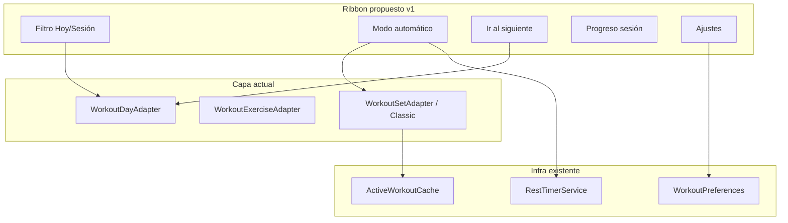
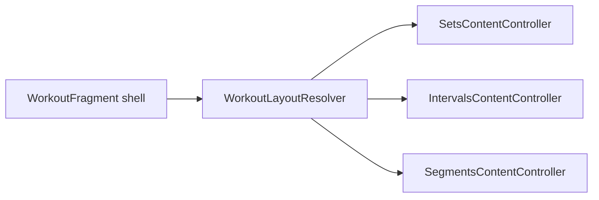

# Mejoras Workout — Ribbon, Ajustes y Vistas por Deporte

## Estado actual (lo que ya tienes)

La pantalla [`fragment_workout.xml`](FrontEnd/app/src/main/res-workout/layout/fragment_workout.xml) tiene un ribbon con 4 acciones:

| Botón | Estado real |
|-------|-------------|
| Expandir / Colapsar | Funcional vía [`WorkoutDayAdapter`](FrontEnd/app/src/main/java/com/fitapp/appfit/feature/workout/presentation/execution/WorkoutDayAdapter.kt) |
| Automático (`btn_history`) | Toast "próximamente" — sin lógica |
| Ajustes | Navega a [`WorkoutPreferencesFragment`](FrontEnd/app/src/main/java/com/fitapp/appfit/feature/workout/presentation/preferences/WorkoutPreferencesFragment.kt) |

**Datos ya disponibles en el modelo** ([`RoutineExerciseResponse`](FrontEnd/app/src/main/java/com/fitapp/appfit/feature/routine/model/rutinexercise/response/RoutineExersiceResponse.kt)):
- `dayOfWeek` + `sessionNumber` + `sessionOrder`
- `restAfterSet` (por set) y `restAfterExercise` (por ejercicio)
- Modos especiales: AMRAP, EMOM, Tabata, circuitos, supersets
- `routine.sportId` / `sportName`, `trainingDays`, `sessionsPerWeek`

**Lógica parcial de auto-avance** ya existe en [`WorkoutSetAdapter`](FrontEnd/app/src/main/java/com/fitapp/appfit/feature/workout/presentation/execution/WorkoutSetAdapter.kt) (`isSequenceMode()` + descanso automático tras duración), pero **no está conectada al botón del ribbon** ni funciona al marcar un set de reps/peso como completado (backlog #1).

**Agrupación en ejecución**: solo por `dayOfWeek`. En edición ([`RoutineExerciseAdapter`](FrontEnd/app/src/main/java/com/fitapp/appfit/feature/routine/ui/exercises/RoutineExerciseAdapter.kt)) ya distingue días vs sesiones — falta replicar eso en workout (backlog #8).



---

## Punto 1 — Barra superior: funcionalidades útiles

### Propuesta de ribbon v1 (reemplazar acciones débiles)

**Fila 1** (mantener): nombre rutina + cronómetro de sesión.

**Fila 2** (reorganizar):

| Acción | Descripción | Reemplaza |
|--------|-------------|-----------|
| **Filtro** | Chip/bottom sheet: Todo / Hoy / Sesión N | — (nuevo) |
| **Automático** | Toggle ON/OFF con estado visual | `btn_history` actual |
| **Siguiente** | Scroll + expand al primer set incompleto | Expandir/Colapsar (mover a menú secundario o long-press) |
| **Progreso** | Badge "12/34 sets" en ribbon | — (nuevo) |
| **Ajustes** | Mantener | — |

Expandir/Colapsar puede quedar como opción dentro del bottom sheet de filtro o como icono secundario — no merece 2 botones principales del ribbon.

---

### Por dificultad — Punto 1

#### Fácil (1–2 días cada uno)

1. **Badge de progreso global** en el ribbon  
   - Fuente: [`WorkoutCompletionState`](FrontEnd/app/src/main/java/com/fitapp/appfit/feature/workout/domain/model/WorkoutCompletionState.kt) (`getAllCompletedSets()` vs total sets de la rutina).  
   - Archivos: `fragment_workout.xml`, [`WorkoutFragment.kt`](FrontEnd/app/src/main/java/com/fitapp/appfit/feature/workout/presentation/execution/WorkoutFragment.kt).

2. **Filtro "Solo hoy"** para rutinas con `trainingDays`  
   - Detectar día: `LocalDate.now().dayOfWeek.name` (misma lógica que [`WeeklyStatsHelper.findPlannedForToday`](FrontEnd/app/src/main/java/com/fitapp/appfit/feature/home/domain/WeeklyStatsHelper.kt)).  
   - Añadir `filterMode` en `WorkoutDayAdapter.submitRoutine()` para filtrar la lista de días.  
   - Auto-activar si hoy ∈ `routine.trainingDays`.  
   - Persistir preferencia en [`WorkoutPreferences`](FrontEnd/app/src/main/java/com/fitapp/appfit/feature/workout/util/WorkoutPreferences.kt).

3. **Botón "Ir al siguiente"**  
   - Recorrer ejercicios/sets, encontrar el primero no completado, expandir día + ejercicio, hacer scroll.  
   - Requiere callbacks día→ejercicio en adapters (`expandDay`, `expandExercise`, `scrollToPosition`).

4. **Rediseño visual del ribbon**  
   - Chips Material con estado activo (filtro/automático ON).  
   - Corregir separador duplicado en XML (líneas 163–168).  
   - Mostrar subtítulo: "Lunes · 5 ejercicios" cuando filtro activo.

5. **Pausar cronómetro de sesión**  
   - Tap en `layout_timer` → pausa/reanuda (útil en descansos largos).

#### Media (3–5 días cada uno)

6. **Filtro por sesión** (`sessionNumber`)  
   - Si la rutina **no** usa días (`exercises.none { it.dayOfWeek != null }`), agrupar como en `RoutineExerciseAdapter` por sesión.  
   - Bottom sheet: Sesión 1 / 2 / 3 / Todo.  
   - Opcional v1: sugerir sesión del día con heurística simple (`sessionNumber = (weekOfYear % sessionsPerWeek) + 1`) — documentar como aproximación, no perfecta.

7. **Modo automático básico (toggle ribbon)**  
   - Nueva pref `autoRestEnabled` en `WorkoutPreferences`.  
   - Al marcar set completado (checkbox en Classic/Modern): si `restAfterSet > 0` → iniciar descanso automático.  
   - Reutilizar [`RestTimerService`](FrontEnd/app/src/main/java/com/fitapp/appfit/feature/workout/service/RestTimerService.kt) (ya resuelve sonido con pantalla apagada — backlog #2).  
   - Mostrar countdown en ribbon cuando timer activo + botón "Saltar".  
   - Propagar flag desde `WorkoutFragment` → `WorkoutExerciseAdapter` → set adapters vía constructor o interfaz `WorkoutExecutionConfig`.

8. **Auto-expandir ejercicio activo**  
   - Con modo automático ON: colapsar ejercicios completados, expandir el actual, scroll suave.

9. **Descanso por defecto global**  
   - Si `restAfterSet == 0` pero auto mode ON → usar fallback configurable (ej. 60s) desde ajustes.  
   - Evita el debate del "tiempo de ejecución por rep" — es más predecible.

#### Difícil (post-v1 o v1.5)

10. **Modo automático completo (flujo guiado)**  
    - Secuencia: completar set → descanso → auto-scroll al siguiente set → si es duración, auto-iniciar countdown (ya parcial en `WorkoutSetAdapter`).  
    - Unificar lógica duplicada entre Classic y Modern en un `WorkoutAutoFlowController`.  
    - Manejar supersets/circuitos (`circuitGroupId`, `superSetGroupId`): avanzar dentro del grupo antes de saltar ejercicio.

11. **Tiempo de ejecución por defecto para sets de reps/peso**  
    - **Opinión: posponer.** Requiere estimar tempo (reps × segundos/rep) o timer manual por set — alto riesgo de frustrar al usuario si no coincide con la realidad.  
    - Alternativa más útil: botón "Iniciar serie" con countdown opcional de 3-2-1 antes de empezar (fácil de entender).

12. **Modos especiales ejecutables** (AMRAP/EMOM/Tabata)  
    - Hoy solo se muestran como badges en [`WorkoutExerciseAdapter`](FrontEnd/app/src/main/java/com/fitapp/appfit/feature/workout/presentation/execution/WorkoutExerciseAdapter.kt).  
    - Auto mode debería activar timers específicos según `amrapDurationSeconds`, `emomIntervalSeconds`, etc.  
    - Es un sub-proyecto grande; encaja mejor con el perfil "Intervalos" del punto 3.

#### Extras sugeridos (ribbon, cualquier dificultad)

- **Historial rápido**: enlace al último workout de esta rutina (navegación a `WorkoutHistoryFragment` filtrado) — reutiliza historial existente.
- **Notas visibles**: toggle rápido para mostrar/ocultar notas de ejercicio en la lista.
- **Undo último set**: Snackbar "Set desmarcado" tras completar por error.

---

## Punto 2 — Ajustes enfocados en la rutina

Los ajustes actuales ([`fragment_workout_preferences.xml`](FrontEnd/app/src/main/res-workout/layout/fragment_workout_preferences.xml)) son correctos para **feedback sensorial** (vibración, sonido, volumen, vista de sets), pero no ayudan a **ejecutar** la rutina.

### Reorganización propuesta de secciones

```
1. DURANTE EL ENTRENAMIENTO  ← nuevo, lo más importante
2. DESCANSOS Y TIMERS        ← mover sonido/vibración aquí
3. VISUALIZACIÓN             ← vista sets + densidad
4. AVANZADO                  ← post-v1
```

### Por dificultad — Punto 2

#### Fácil

1. **"Filtrar al abrir: solo el día de hoy"** — switch (pareado con filtro del ribbon).
2. **"Iniciar descanso automáticamente"** — switch (pareado con modo automático).
3. **"Mantener pantalla encendida"** — `FLAG_KEEP_SCREEN_ON` en `WorkoutFragment` (backlog #15 relacionado).
4. **Descanso por defecto** — slider 0–180s cuando el set no define `restAfterSet`.
5. Renombrar título: "Configuración de entrenamiento" → secciones más claras con descripciones orientadas a la rutina ("Qué ver mientras entrenas").

#### Media

6. **"Expandir solo ejercicio activo"** — switch.
7. **"Ocultar días/sesiones vacías o completadas"** — reduce ruido visual.
8. **"Rellenar con última sesión"** — toggle (ya ocurre por defecto; dar control al usuario).
9. **Densidad de lista**: Compacta / Cómoda — afecta padding de `item_workout_exercise.xml` / `item_workout_set.xml`.
10. Mover **vista de sets** a sección "Visualización" y añadir preview mini (thumbnail o descripción más clara).

#### Difícil

11. **Perfil de rutina automático** — detectar si es fuerza/cardio y preseleccionar ajustes (preparación para punto 3).
12. **Ajustes por rutina** (no globales) — guardar en Room junto a la rutina: "esta rutina de running siempre filtra sesión 2 los martes".
13. **Unidades kg/lb** en ejecución (backlog #14) — requiere conversión en `WorkoutParameterHelper`.

---

## Punto 3 — Vistas por tipo de ejercicio/deporte (visión post-v1)

### Opinión

No conviene una vista distinta **por deporte** (running, natación, gym…) — serían demasiadas UIs. Mejor un sistema de **3–4 perfiles de ejecución** que se eligen por heurística y se pueden override manualmente:

| Perfil | Cuándo | UX principal |
|--------|--------|--------------|
| **Sets** (actual) | Reps/peso, gym general | Día → ejercicio → lista de sets |
| **Intervalos** | Tabata, EMOM, AMRAP, HIIT | Timer grande central, fase trabajo/descanso, pocos controles |
| **Segmentos** | Running, natación, rutas | Lista lineal de bloques (calentamiento → series → enfriamiento), énfasis en distancia/tiempo/ritmo |
| **Circuito** | `circuitGroupId` presente | Carrusel o stepper horizontal por estación + contador de rondas |

Detección heurística (futuro `WorkoutLayoutResolver`):

```kotlin
fun resolveProfile(routine: RoutineResponse): ExecutionProfile {
    val exercises = routine.exercises.orEmpty()
    when {
        exercises.any { it.tabataWorkSeconds != null || it.emomIntervalSeconds != null } ->
            ExecutionProfile.INTERVALS
        exercises.any { !it.circuitGroupId.isNullOrBlank() } ->
            ExecutionProfile.CIRCUIT
        routine.sportName in CARDIO_SPORTS || dominantParamType == DISTANCE ->
            ExecutionProfile.SEGMENTS
        else -> ExecutionProfile.SETS
    }
}
```

`CARDIO_SPORTS` = running, ciclismo, natación, etc. (lista configurable).

### Arquitectura recomendada (no implementar en v1)



- **Shell común**: ribbon, cronómetro, FAB guardar, `WorkoutExecutionViewModel`, `ActiveWorkoutCache`.
- **Controllers intercambiables**: cada uno implementa `bind(routine)`, `onSetComplete()`, `getProgress()`.
- **Mismo guardado de sesión**: `SaveWorkoutSessionUseCase` no cambia — solo cambia cómo se capturan valores en UI.

Running/natación/rutas comparten perfil **Segmentos**; la diferencia (GPS, vueltas en piscina) sería capa v3 encima del mismo layout de bloques.

### Por dificultad — Punto 3 (roadmap post-v1)

#### Fácil (fundamentos)

1. Extraer interfaz `WorkoutContentController` desde la lógica actual de `WorkoutDayAdapter`.
2. Añadir `ExecutionProfile` enum + resolver stub que siempre devuelve SETS.
3. Guardar `sportName` visible en ribbon ("Running · Rutina X").

#### Media

4. Implementar **IntervalsContentController** aprovechando datos AMRAP/EMOM/Tabata ya en el modelo.
5. Vista **Segmentos** básica: un solo `RecyclerView` plano (sin anidar día→ejercicio→set), bloques con distancia/duración prominentes.
6. Selector manual de perfil en ajustes ("Forzar vista: Automático / Sets / Intervalos / Segmentos").

#### Difícil

7. **CircuitContentController** con navegación por estaciones y sincronización de rondas.
8. Integración GPS / mapa para rutas (dependencia externa, permisos, background).
9. Perfiles por categoría de ejercicio desde backend (metadata en `SportResponse` o categorías).
10. Temas/skins por deporte sobre el mismo controller (iconografía, colores, métricas prioritarias).

---

## Priorización recomendada para v1

Alineado con [`docs/BACKLOG.md`](docs/BACKLOG.md) (#1 timers automáticos, #8 días, #16 toolbar, #15 ocultar nav):

| Orden | Item | Dificultad | Impacto |
|-------|------|------------|---------|
| 1 | Filtro "Hoy" + agrupación por sesión | Fácil/Media | Alto — reduce ruido de rutina completa |
| 2 | Modo automático: descanso al completar set | Media | Alto — backlog #1 |
| 3 | Progreso + "Ir al siguiente" + ribbon visual | Fácil | Medio — UX inmediata |
| 4 | Ajustes "Durante el entrenamiento" | Fácil | Medio |
| 5 | RestTimerService unificado en auto mode | Media | Alto — backlog #2 |
| 6 | Mantener pantalla / ocultar bottom nav | Fácil | Medio — backlog #15 |

**Posponer v1**: tiempo de ejecución por rep, modos AMRAP/EMOM ejecutables, perfiles de vista alternativos.

---

## Archivos principales a tocar (v1)

- [`fragment_workout.xml`](FrontEnd/app/src/main/res-workout/layout/fragment_workout.xml) — nuevo ribbon
- [`WorkoutFragment.kt`](FrontEnd/app/src/main/java/com/fitapp/appfit/feature/workout/presentation/execution/WorkoutFragment.kt) — filtros, auto mode, progreso
- [`WorkoutDayAdapter.kt`](FrontEnd/app/src/main/java/com/fitapp/appfit/feature/workout/presentation/execution/WorkoutDayAdapter.kt) — filtro día/sesión, expand helpers
- [`WorkoutSetAdapterClassic.kt`](FrontEnd/app/src/main/java/com/fitapp/appfit/feature/workout/presentation/execution/WorkoutSetAdapterClassic.kt) + [`WorkoutSetAdapter.kt`](FrontEnd/app/src/main/java/com/fitapp/appfit/feature/workout/presentation/execution/WorkoutSetAdapter.kt) — hook auto-rest on complete
- [`WorkoutPreferences.kt`](FrontEnd/app/src/main/java/com/fitapp/appfit/feature/workout/util/WorkoutPreferences.kt) + [`fragment_workout_preferences.xml`](FrontEnd/app/src/main/res-workout/layout/fragment_workout_preferences.xml) — nuevas prefs
- Opcional: nuevo `bottom_sheet_workout_filter.xml` para filtro día/sesión
